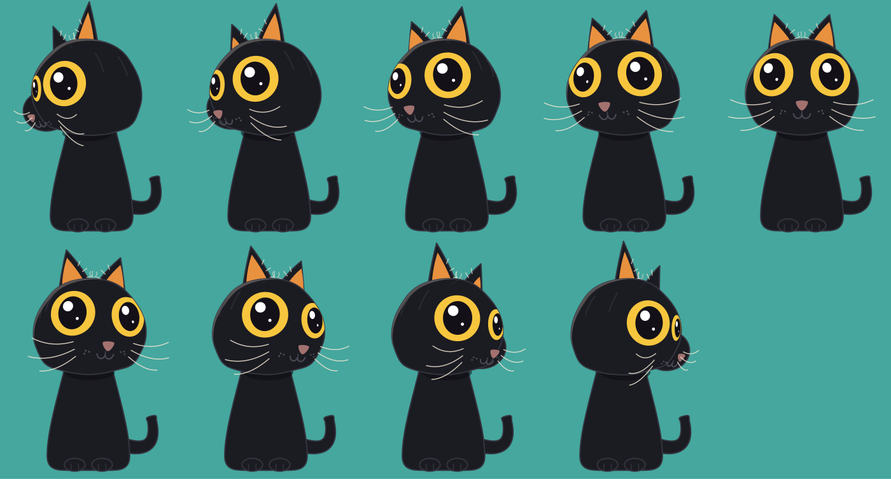

# Cat Face

A black cat with big amber eyes, sitting on a teal ground. Its face is drawn
flat but rigged to a sphere, so turning its head slides, foreshortens and
occludes every feature the way a real one would. Same trick as the Figma piece
it is modelled on — the artwork never leaves 2D, the *anchors* do the work.

Drag across the face (or tilt the device) and the head follows. Leave it alone
and it looks around by itself, and blinks.



## How the illusion works

Every feature is pinned to a longitude/latitude on an invisible unit sphere.
For a given head pose the engine rotates that anchor, projects it, and hands
back a **tangent frame** — a 2D affine transform describing the little patch of
surface at that spot. Features are then drawn as plain flat vectors into their
frame:

```swift
let frame = projector.tangentFrame(lon: 0.455, lat: 0.045)
var eye = PathBuilder()
eye.ellipse(center: .zero, rx: eyeRadius, ry: eyeRadius)   // just a circle
shapes.append(Shape2D(
    commands: PathBuilder.transformed(eye.commands, by: frame.transform),
    style: .outlined(fill: .paper, stroke: .ink, width: 7)
))
```

The circle arrives squashed, shifted and tilted correctly for the pose. Nothing
is keyframed and there are no per-angle variants of the face.

A few details carry most of the effect:

| Detail | Why it matters |
| --- | --- |
| **The snout is a volume** | A sphere set in front of the skull, painted under the head so its own fill hides all but the protruding bump. Square-on it is invisible; on a turn it breaks the silhouette ahead of the cheek. A silhouette that changes *shape* is the clearest evidence the head is solid, and it is what separates a head from a ball with a face on it. |
| **Muzzle features ride the snout** | Nose, mouth, pads and whisker roots are lifted off the skull, so they swing ahead of the face on a turn instead of sliding across it. |
| **Rim light and contact shadow** | A ribbon down the lit edge of the head, tapering to nothing at both ends because a stroke cannot fade along its length; and the head's shadow on the chest, painted under the skull so only a crescent survives. |
| **Pupils on a lifted sphere** | Drawn at radius `1 + lift`, so they parallax against the eye whites on a turn. Strongest depth cue on the face. |
| **Fur sheen as sphere arcs** | Sampled along the surface and split wherever they round out of sight. Light wrapping the skull proves it is a volume. |
| **Sheen behind the ear** | Culled entirely head-on. It only ever appears on a hard turn, which is the payoff. |
| **Clipping to the silhouette** | Near the rim a tangent frame flattens but never vanishes, so face detail is cut off at the head outline instead of hanging off it. |
| **Ears solved in 3D** | Three head-space corners, not a tangent-plane decal, so they rotate rather than slide. |
| **Whiskers leave the surface** | A root on the sphere plus a direction splaying outward and forward; ones rooted on the far side are painted *behind* the head. |

Two constraints are worth knowing before you change proportions, both
documented in the code:

- **Features live on the unit sphere**, so `HeadShape`'s width and height axes
  must stay at 1. An axis below 1 pulls the outline *inside* the surface the
  features sit on and they escape the head — the ear roots go first. Shape the
  head with `CatRig`'s radial profile instead, which can only push the outline
  outward.
- **Ear bases sit forward on the skull.** A base ridge running front-to-back
  lands near the limb, where a turn foreshortens it to nothing and the far ear
  disappears.
- **The head outline and the snout must wind the same way.** They share a clip
  path, and under the non-zero fill rule opposite windings subtract instead of
  union — punching a hole through the face exactly where the muzzle sits.
- **Things that round away shrink; they do not fade.** The far eye takes its
  height down with its width, or it becomes a tall sliver sliced flat by the
  silhouette. The inner ear shrinks toward the ear's centroid, because orange at
  partial opacity over black fur goes muddy brown and reads as dirt.

## Layout

```
Sources/
  FaceEngine/     Pure geometry. No UI frameworks — builds and tests anywhere.
    Geometry      Vec3, Point2, Transform2D
    Projection    Pose, HeadShape, Projector — rotate, project, tangent frames
    Drawing       Semantic paints and flat shapes; no colours in the engine
    Spline        Catmull–Rom, so outlines are sampled rather than hand-tuned
    CatRig        The cat: where every feature is anchored and how it is drawn
    FaceAnimator  Spring tracking, idle wander, blinking
    SVGExport     Stills, and a way to check the rig off-platform
  CatFaceUI/      SwiftUI: Canvas renderer, palette, pointer + CoreMotion input
  FacePreview/    CLI that dumps SVG frames
App/              iOS + macOS app target
Tests/            35 tests over the engine
```

`CatFaceUI` is wrapped in `#if canImport(SwiftUI)`, so `swift build` and
`swift test` work on Linux too.

## Running it

**On the iOS simulator**, from the repo root:

```
./scripts/run-ios.sh              # newest available iPhone, or one already booted
./scripts/run-ios.sh "iPhone 16"  # a named device
```

It builds, boots the simulator, installs and launches. `xcrun simctl list
devices available` lists the names it accepts.

**On your own iPhone** the app has to be signed, which takes a one-time setup.
A free Apple ID is enough:

1. Xcode ▸ Settings ▸ Accounts, sign in with your Apple ID.
2. Open `App/CatFace.xcodeproj`, select the **CatFace** target ▸ **Signing &
   Capabilities**, tick *Automatically manage signing* and pick your name under
   **Team**. If the bundle identifier is rejected as taken, change it to
   something of your own, e.g. `com.yourname.CatFace`.
3. Plug the phone in, unlock it, tap **Trust**, pick it in the toolbar, and Run.
4. First launch only: the phone will refuse an untrusted certificate. Approve it
   at Settings ▸ General ▸ VPN & Device Management ▸ your Apple ID ▸ **Trust**.

After that, from the terminal:

```
./scripts/run-device.sh                         # auto-detects team and device
BUNDLE_ID=com.yourname.CatFace ./scripts/run-device.sh
```

On a free Apple ID the signature lasts **seven days**, after which the app stops
opening until you run it again. A paid developer account lifts that.

Tilt tracking is device-only — the simulator has no motion hardware, so the
**Tilt** control is hidden there.

**In Xcode** — open `App/CatFace.xcodeproj` and run. iOS 16+ / macOS 13+,
multiplatform target, no dependencies. The project pulls `CatFaceUI` from the
package at the repo root.

If the project will not open in your Xcode, it takes a minute to rebuild: make
a new multiplatform App, delete its `ContentView`, add the repo root as a local
package (File ▸ Add Package Dependencies ▸ Add Local), link `CatFaceUI`, and
paste `App/CatFace/CatFaceApp.swift` over the generated app file.

**The engine alone** — open `Package.swift` in Xcode, or:

```
swift test
swift run face-preview preview     # writes SVG stills + a contact sheet
```

`face-preview` is how the face was tuned: it renders the same drawings the app
does, so you can check a proportion change without launching anything.

## Controls

| Control | Effect |
| --- | --- |
| Drag / hover | Head follows the pointer; the eyes take over once the neck runs out of travel |
| **Touch / Tilt** | Switches between pointer and device motion. Tilt re-centres on whatever attitude you start from |
| **Rig** | Draws the construction sphere, the anchor points and their local axes over the face |

Leave it idle and the wander starts after a couple of seconds. It is suppressed
when Reduce Motion is on — the head you drive yourself still moves.

## Tuning

Proportions live in `CatProportions`, pose limits in `PoseLimits`, and the
palettes in `PaintTable`. The engine only ever names semantic paints (`fur`,
`iris`, `pupil`, `glint`, `innerEar`, `nose`, `whisker`, `marking`, `shade`,
`ink`, `guide`), so light mode, dark mode and SVG export all resolve from one
table and cannot drift apart. Recolouring the cat is a change to that table
alone — the rig never names a colour.

The coat, the chest, the paws and the tail are all the same black, so the `ink`
rim is the only thing separating them. It is a hair *lighter* than `fur`, read
as light catching the edge of the fur rather than as an outline.
